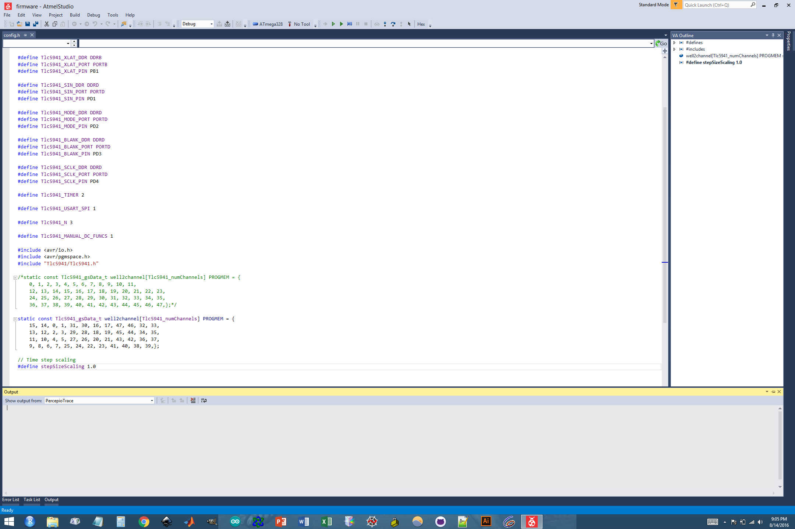

LPA time step calibration
=============================
.. Warning::
   This procedure should only be performed with LPA v1.0. Later versions use a different resonator which do not require time step calibration.

  The firmware project with the config.h file open, showing the stepSizeScaling parameter used to perform LPA time calibration.

The resonator (535-10008-1-ND) used with the LPA v1.0 design has a tolerance which produces a small time error. For long experiments, this can become significant. To correct for this time scaling, one can adjust the stepSizeScaling (Supplementary Fig. S12) in the firmware config.h file. This parameter (set to 1.0 by default) will scale the time steps of the programs run on the device. The correction is best done by running a long (12 h <) program on the device and noting (by indicator LEDs or well LEDs) the actual length of the experiment. The stepSizeScaling then should be set to the ratio of desired time to actual time.
