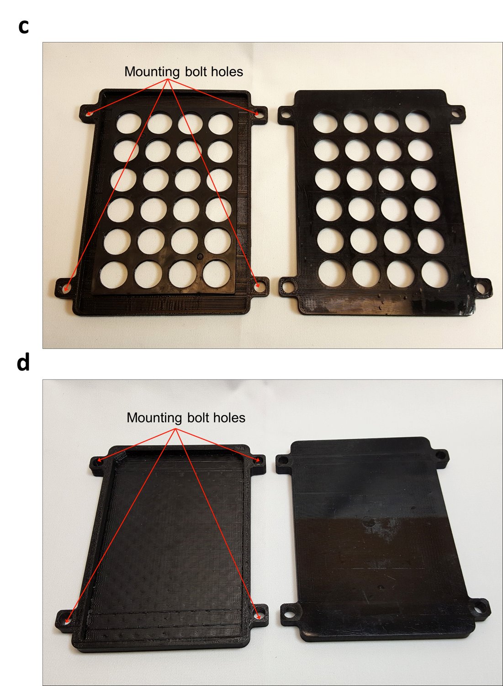

-----------------------------
Chassis
-----------------------------

Detailed photographs of 3D printed LPA parts
------------------------------------------------

.. image:: chassis_1.png
   :scale: 30%

Bottom and top perspectives of 3D printed LPA parts are shown.
These include (a) mounting plate, (b) LED spacer, (c) cell culture plate adapter, and (d) device lid.
If shaking culture is required, the mounting plate platform holes must be designed for a particular platform.
The two mounting plates shown were designed for two different shaking platforms.

Photographs of LPA gaskets
------------------------------------------------

.. image:: gaskets.png
   :scale: 30%

LPA gaskets are laser cut (see Supplementary Method on Laser cutting gaskets) from nitrile sheets (Supplementary Table S6) and prevent light leakage and crosstalk between wells.
(a) The (i) circuit board, (ii) LED spacer, and (iii) cell culture plate adapter gaskets are shown.
Gasket names are based on the layer they lay atop.
Though not necessary, we found it convenient to superglue on the cell culture plate adapter gasket.
(b) A plate adapter gasket which has been laser cut with patterns centered with wells of the culture plate.
