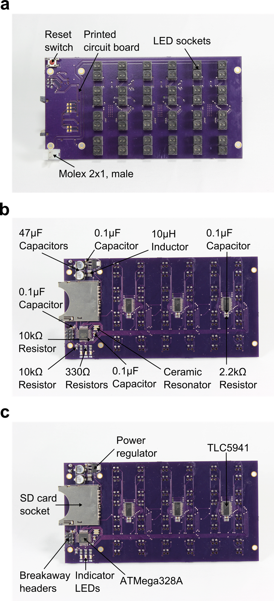
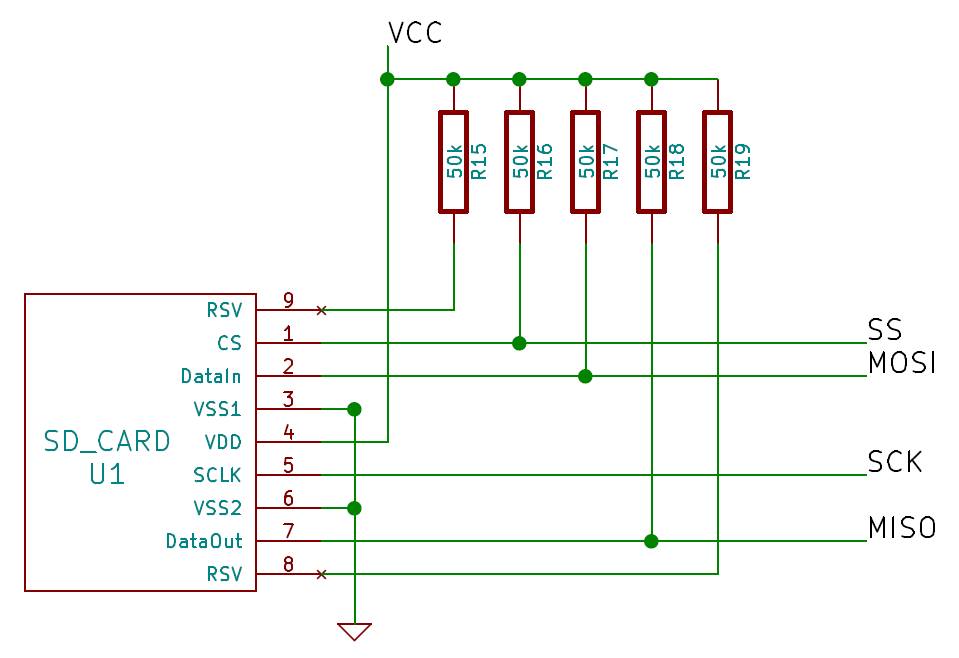
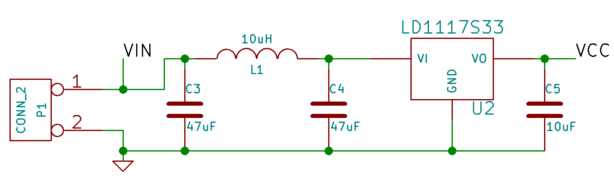

-----------------------------
Electronics
-----------------------------

Detailed circuit board photographs
--------------------------------------

   Detailed photographs of the LPA circuit board populated with electrical components from Supplementary Table S1.
   Panels show (a) top-down and (b-c) bottom-up perspectives.
   The method for soldering circuit board components can be found in the Supplementary Method on circuit board fabrication and assembly.
   The significance of each circuit board component is described in Supplementary Figs. S2-S5.

Circuit board SD-card reader stage schematic
------------------------------------------------

   The SD card reader stage contains the hardware needed for the microcontroller to properly read an SD card.
   This stage includes the SD card socket (U1), a series of 50kΩ pull-up resistors (R15-R19), and the connections to the microcontroller (SS, MOSI, SCK, MISO), regulated power line (VCC) and ground
   The SD card is operated in Serial Peripheral Interface (SPI) Mode, and has been wired to the microcontroller accordingly1,2, with lines SS, MOSI, SCK, and MISO going to pins PB2 (14), PB3 (15), PB5 (16) and PB4 (17), respectively.
   If the internal pull-ups of the microcontroller are used, resistors R15 through R19 are not needed.

Circuit board microcontroller stage schematic
-----------------------------------------------------

.. figure:: microcontroller.png
   :scale: 50%
   :figwidth: 100%

   The microcontroller stage contains the microcontroller, programming pins, reset button, and status LEDs.
   The microcontroller is an Atmel ATMEGA3281, which receives its power from the regulated power line (VCC).
   A pair of decoupling capacitors have been included in the design (C1, C2).
   A 16Mhz ceramic resonator with built-in capacitors (Y1) is needed for the microcontroller to function at the appropriate frequency.
   The programming pins (P2) have been wired according to the ISP specifications3, and they are compatible with popular Atmel programmers such as the AVRISP mkII and the AVR Dragon.
   The reset circuit is comprised of button RESET1 and resistor R1. A set of status LEDs (ON, ERR, FIN) with their respective 330Ω current-limiting resistors (R_ON1, R_ERR1, R_FIN1) have been included to read the status of the device while running.

Circuit board LED driver stage schematic
-------------------------------------------

.. figure:: led_driver.png
   :scale: 50%
   :figwidth: 100%

   The LED driver stage contains the hardware needed for controlling the intensity of the LEDs in response to instructions from the microcontroller, and the LEDs themselves.
   The LED Driver Stage is comprised of LED Drivers TLC59414 connected in series. Each TLC5941 is able to control 16 LEDs.
   Therefore, 3 are used in the 24-well LPA which contains 2 LEDs per well. Only one of these drivers (U3) is shown.
   The driver receives power from the regulated power line VCC. A decoupling capacitor has been included for each driver chip.
   The anodes of the LEDs (D1-D8 and D25-D32) are connected to the unregulated power line (VIN), and the cathodes to one of the output pins of the driver.
   The TLC5941 implements a constant-current sink driver for each LED, which is controlled via a serial interface comprised of pins BLANK (2), XLAT (3), SCLK (4), SIN (5), MODE (6), and GSCLK (25). Pins BLANK, XLAT, SCLK, MODE and GSCLK of all the drivers are connected to pins PD3 (1), PB1 (13), PD4 (2), PD2 (32), and PB0 (12) of the microcontroller (Supplementary Fig. S3).
   Only for the first LED driver, pin SIN (5) is connected to pin PD1 (31) of the microcontroller.
   Serial connection of several LED drivers is achieved by connecting pin SOUT (24) of one driver to pin SIN (5) of the next driver.
   The SOUT pin of the last driver is left unconnected. Pin IREF (27) is connected to ground through a 2.2kΩ resistor.
   This sets the maximum current in each output of the driver to 17.8 mA4.
   Pins SIN and SCK are seen from the microcontroller as an SPI interface.
   However, the microcontroller is already using its only SPI module to communicate with the SD card.
   To solve this, the microcontroller has been configured to use its Universal Synchronous and Asynchronous serial Receiver and Transmitter (USART) Module in SPI mode1.
   For more details, consult the firmware documentation.

Circuit board power stage schematic
-----------------------------------------------------

   The power stage supplies electric power to the other stages.
   The power stage produces two power lines: regulated low power (VCC), which feeds the microcontroller and other integrated circuits, and unregulated high power (VIN), which is taken directly from the input power connector, and feeds the LEDs.
   Power through the LEDs is switched by the TLC5941 LED drivers; therefore the input power can be up to 17V unregulated, in accordance with the TLC5941 specifications4.
   Regulated power at 3.3V is generated by a standard voltage regulator integrated circuit LD1117S335, which is preceded by an LC filter (C3, C4 and L1) and followed by a stabilization capacitor (C5).
   Separating LED power from regulated power allows for a more stable regulated power line that is not affected by switching of large currents, while allowing for an arbitrary number of LEDs to be placed without changes in the power stage.
   Ground is taken directly from the input power line.
