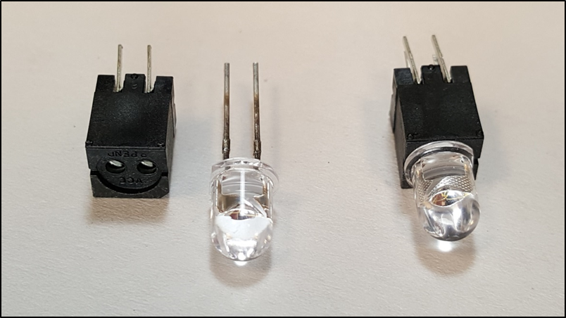

-----------------------------
Miscellaneous
-----------------------------

LPA power connections
-----------------------------------

.. image:: power_connections.png
   :scale: 30%

The LPA requires a continuous 5V DC power supply and power connections must be reinforced during experiments to prevent movement and mechanical stress, particularly for shaking culture.
Standard laboratory tape can be used as shown to secure power connections and free wires.

Photographs of 3D printed auxiliary parts
------------------------------------------------

.. image:: auxillary.png
   :scale: 30%

The LED socket aligner is used to align and secure LED sockets to the circuit board during soldering (see Supplementary Method on circuit board fabrication and assembly).
(b) The probe adapter is used to position and align the spectrometer probe while making LED intensity measurements (see Supplementary Method on LED calibration).
Top and Bottom versions of the part are used for alignment with Top and Bottom LEDs, respectively.
(c) The flow tube holder holds and spaces flow cytometry tubes with the same geometry as wells from the cell culture plate.
The holder allows easy transfer of samples from the culture plate to flow tubes using a multichannel pipettor (LT12-1200, Ranin).
The part is snapped together and epoxied from three separately printed parts: top rack, bottom rack, and pegs.

Close-up photograph of LED and LED socket friction fit
----------------------------------------------------------

LEDs are positioned, aligned, and held in place by mating with an LED socket (Supplementary Table S1) via friction fit.
This fixture system allows LEDs in the LPA to be easily be installed, removed, and reconfigured.

Photograph and schematic of culture plate used in the LPA
----------------------------------------------------------------

.. image:: culture_plate.png
   :scale: 30%

\(a) Top and bottom views of the 24-well culture plate (AWLS-303008, ArcticWhite LLC) used in the LPA.
\(b) A schematic (adapted from supplier schematic) showing the important dimensions (mm) of the plate.
The original schematic can be requested from ArcticWhite LLC.
